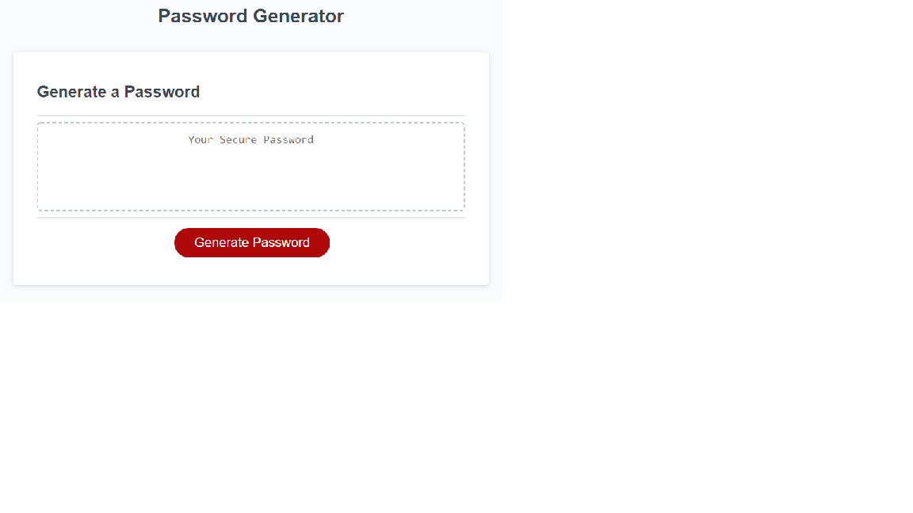
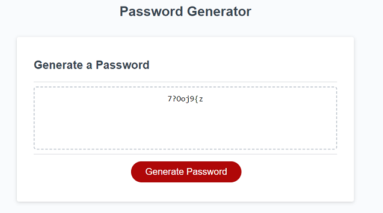

# | Password-Generator |

GitHub Link: https://github.com/Maeldeis/Password-Generator

Deployed Live Link: https://maeldeis.github.io/Password-Generator/

**An application that an employee can use to generate a random password.**

This app will run in the browser, and will feature dynamically updated HTML and CSS powered by JavaScript code.

* Generates a password on button click
  * Presents a series of criteria prompts
    * Length of password
      * 8 to 128 characters
    * Character types include:
      * Lowercase
      * Uppercase
      * Numeric
      * Special characters ($@%&*, etc)
  * Code validates each input and at least one character type will be selected
  * Once prompts are answered then the password is generated and displayed written on the page

**Before & After**
\

\
**To view the programmed data as shown, open the console in Dev Tools**